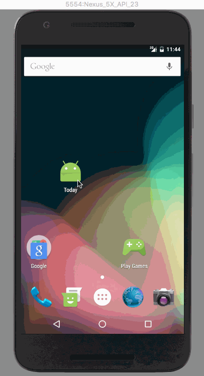

# Today
> It is a MVP example app.

> It can find history events happened on the same day.

* demo


* usage
Insert these code in your activity onCreate:
```
mainPresenter = new MainPresenter(format.format(new Date()),this);
mainPresenter.loadData();
```
make your activity implements Mainview,then you can loadLastData or loadNextData:
```
case R.id.lastBtn:
            mainPresenter.loadLastData();
            break;
case R.id.nextBtn:
            mainPresenter.loadNextData();
            break;
```